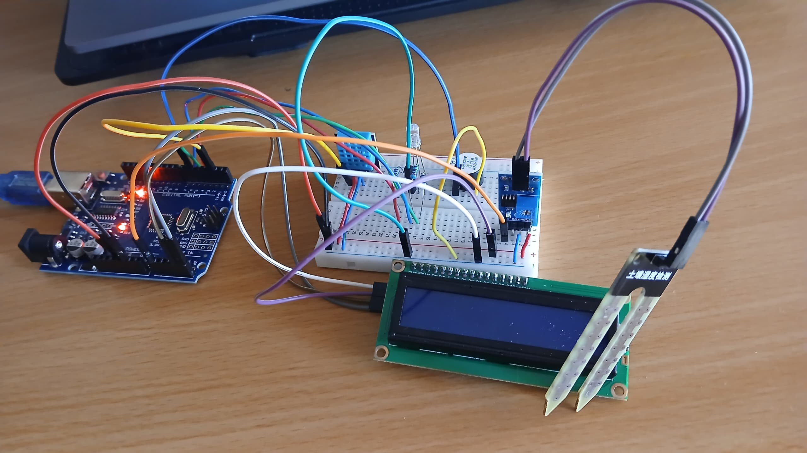

# Sistema-de-Monitoreo-de-Plantas

## 🔍 Descripción
Este sistema inteligente de monitoreo de plantas está diseñado con Arduino Uno para medir la humedad del suelo de la planta, la temperatura ambiente y la humedad del ambiente y mostrar los datos en una pantalla LCD 16x2. El sistema emite alertas visuales a través de LEDs y una alarma (buzzer) cuando las condiciones se vuelven críticas, lo que ayuda a los usuarios a mantener una salud óptima de las plantas.

## 🛠️ Componentes
- Arduino UNO R3
- RGB LED (Common Cathode)
- Display LCD 16x2 con I2C
- DHT11 Sensor
- Soil Moisture Sensor
- Buzzer
- 3 resistencias de 220
- Cables Jumper
- Protoboard

## 💻 Código
[Código](./Main/Main.ino)

## 📌 Características
✅ Sensor de humedad de suelo: Mide el nivel de agua en el suelo y sirve para determinar si el suelo está seco, existe riego excesivo o las condiciones son normales. 

✅ Sensor DHT11: Mide la temperatura y humedad del entorno.

✅ Display LCD 16x2 con I2C: Muestra datos en tiempo real para la humedad del suelo, temperatura y humedad del ambiente. 

✅ LED RGB (Common Cathode): 
- Verde 🟢: Humedad del suelo normal. 
- Azul 🔵: Humedad excesiva. 
- Rojo 🔴: Suelo muy seco. 

✅ Buzzer: Alerta cuando las condiciones se vuelven críticas (suelo muy seco o humedad excesiva). 

## 📌 Funcionamiento
1️⃣ El sensor de humedad de suelo detecta el porcentaje de humedad en el suelo y proporciona un valor analógico.

2️⃣ El sensor DHT11 mide la temperatura y la humedad del entorno y envía los datos al Arduino. 

3️⃣ El display LCD 16x2 muestra los valores de la humedad en el suelo, la temperatura y la humedad del entorno.

4️⃣ El LED RGB cambia de color según las condiciones del suelo. 

5️⃣ El Buzzer suena cuando el suelo está seco o hay un exceso de humedad.

## Alertas del sistema
| Condición                  | % Humedad Suelo | Color LED    | Buzzer  |
|----------------------------|-----------------|--------------|---------|
| Normal                     |   40%-80%       |🟢 Verde      | OFF    |
| Muy Seco                   |   <30%          |🔴 Rojo       | ON     |
| Muy Húmedo                 |   >90%          |🔵 Azul       | ON     |

## 📌 Componentes y Cableado 
| Componentes                | Pines               | Conexión con Arduino                      |
|----------------------------|---------------------|-------------------------------------------|
| Sensor de humedad de suelo | VCC, GND, A0        | 5V, GND, A0                               |
| Sensor DHT11               | VCC, GND, Data      | 5V, GND, Pin 2                            |  
| Display LCD                | GND, VCC, SCL, SDA  | GND, 5V, A5 (SCL), A4 (SDA)               |        
| LED RGB (Common Cathode)   | R, CC, G, B         | Pin 3 (R), CC (GND), Pin 4 (B), Pin 5 (G) | 
| Buzzer                     | +, -                | Pin 6, GND                                |

✅ La Protoboard se utiliza para múltiples conexiones de 5 V y GND. 

✅ El LED RGB utiliza cátodo común → HIGH para encendido, LOW para apagado.